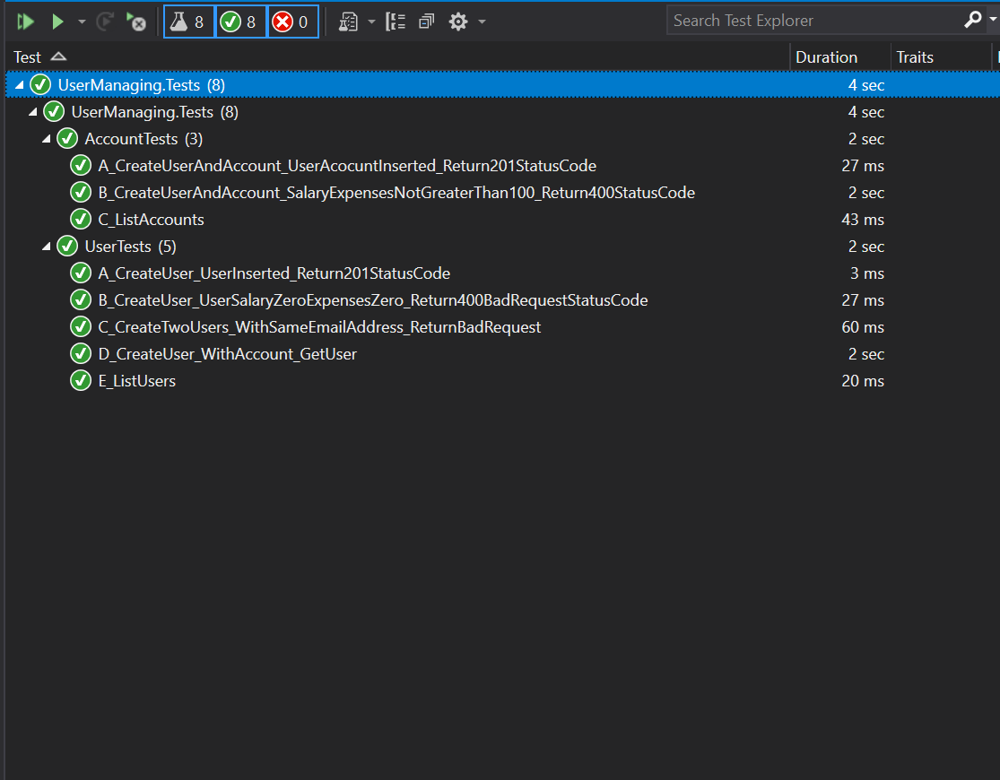

# ZipCo Users API

###  API Solution Structure 
1. This solution is implemented using .Net Core version 3.1 and runs as a WebAPI application
2. The data layer is implemented using .Net core entity framework and Sql Server

3.  The root directory contains README file, src folder and docker compose file
4.  The src folder is a place-holder for a number of services.
5.  Under the `services` folder, ZipCO `ManagingUser` service with all its dependencies stored
6.  This structure follows the Microservice and service oriented architecture
7. This structure is open to extension and new isolated services can be added within their `Bounded Context`
8. Each services eventually is deployed as a container and is isolated from other services
9. In this context,`UserManaging` service is docker ready. Instruction is followed in the end

 #### The `UserManaging`  service is composed of the following projects.
--- 
- <b>UserManaging.Domain </b>
	- This project stores everything around the service domain. Examples like POCO classes like `Account` `User` `AccountType` enumeration etc.
    - The `AccountType` enumeration values are  ZipMoney and ZipPay. The domain CRUD interface is palced here as well
- <b>UserManaging.Infrastructure</b>
  -  This Project configure the entity framework database and `DbContext` .It also implements the domain interface. The Create operation is in this project and Read oeprations are placed
    in the next project. It is a standard .net library
- <b> UserManaging.CQRS</b>
  - This project is based on CQRS pattern and receive incoming request, execute the business logic and return the response to the caller.It utilizes the `MediatR` nugget package for request handling and execute validation
   rules using `FluentValidation` nugget package.Queries are separated into different folders and all the common queries are managed inside the class `UserAccountQueries`.Furthermore this project 
   configures the AutoMapper profile and implements the custom exception classes. 
 - <b> UserManaging.API</b>
   - This project is the .net core Web API. It resolves the dependencies, 
   - The `Users` and `Account` controllers are the API gateway for all CRUD operations.
   - Each controller's action accepts a request  and sends it to appropriate request handler 
   - The request handler triggers each request based on the request type and returns the response.
   - This project implements the <i> `Custom error handler`</i> using Asp.net Middleware
- <b>UserManaging.Test </b>
  - This is the integration test project of the solution. It uses `SqlLite` database version of .Net core EF
  - The test project setup a temporary endpoints host and make HTTP requests using `HttpClient` to actual endpoints
  - Integration tests are covering the following  scenarios 
  1. Creating a New user and making sure it persisted to database
  2. Creating a New user with invalid email address, zero salary and zero expenses and get BadRequest
  3. Create two users with same email address and ensure second user is getting BadRequest due to duplicate email address
  4. Create a user and its account and check if user with its accounts persisted to database 
  5. Create a user with salary and expense difference less than $1000 and get BadRequest
  6. Call `list all users` endpoint and ensure that collection is not empty
  7. Call ` list all accounts` endpoint and ensure that collection is not empty
  8. Create user and account and call `Get User` and ensure it returned the correct record
- <b>docker-compose project </b>
  - This is the docker compose project which pulls sql server and .net core images and build  api project 
  - create the sql server database and run the backend on port 5000.

#### How to run the project 

1. In order to run the API and Sql server, run in the `/src` folder `docker-compose build` and after that `docker-compose up` 
2. When the `docker-compose up ` job is finished, access the backend api using http://localhost:5000 url 
3. The endpoints are configured to show swagger

<b>Example screen when API Swagger loads</b>

<b> Tests result </b>

